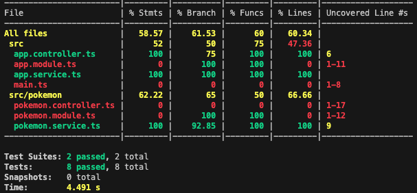
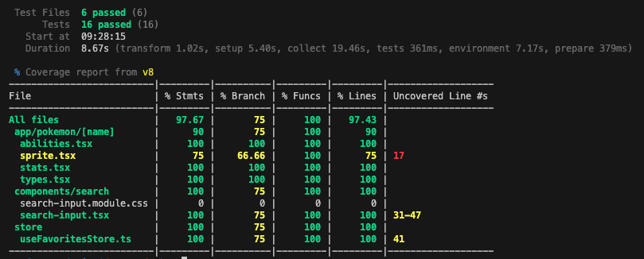

# Pokédex

- Backend: NestJS application (apps/backend)
- Frontend: Next.js (App Router) application (apps/frontend)

## 1. Overall Architecture

```
                          +-------------------------+
                          |        Frontend         |
                          |  Next.js 16 (App Dir)   |
                          |  React 19, MUI, Zustand |
                          +-----------+-------------+
                                      |
                         (HTTP fetch - REST API)
                                      |
                                      v
+-------------------------+   +-------------------------+
|   Browser / Client      |   |        Backend          |
| - Renders pages         |   | NestJS (REST Controllers|
| - Calls API via fetch   |   | Validation / Services   |
|   using BASE URL        |   |                         |
+-------------------------+   +-------------+-----------+
                                      |
                                      v
                               External Data Source
                               (e.g. PokeAPI or future DB)
```

Frontend uses `http://localhost:3000` to connect to the Backend inside [`fetchPokemonList`](apps/frontend/src/lib/poke-api.ts) and [`fetchPokemonByName`](apps/frontend/src/lib/poke-api.ts). 

Backend exposes REST endpoints `/pokemon` and `/pokemon/:name`. (to be extended).

## 2. Install Instructions

From repository root:

```bash
pnpm install
```

Install only one side:

```bash
pnpm --filter backend install
pnpm --filter frontend install
```

## 3. Run Locally

### Backend (NestJS):

Defaults to port 4000

```bash
pnpm dev:backend        # watch mode (alias of start:dev)
pnpm debug:backend      # debug mode (alias of start:debug)
```

Direct from apps folder:

```bash
cd apps/backend
pnpm dev
```

### Frontend (Next.js):

 Defaults to port 3000

```bash
pnpm dev:frontend
```

Direct from apps folder:

```bash
cd apps/frontend
pnpm dev
```

### Storybook

```bash
pnpm storybook
```

Direct from frontend apps folder:

```bash
cd apps/frontend
pnpm storybook
```

## 4. Testing & Coverage

Backend (Jest):

- Unit tests: `pnpm test:backend`
- Watch: `pnpm test:backend:watch`
- Coverage: `pnpm test:backend:cov` (outputs to [apps/backend/coverage/lcov-report](apps/backend/coverage/lcov-report) per config in [apps/backend/package.json](apps/backend/package.json))
- Generates json and html reports.
- Coverage report



Frontend (Vitest + React Testing Library):

- Tests: `pnpm test:frontend`
- Watch: `pnpm test:frontend:watch`
- Coverage: `pnpm test:frontend:watch` (outputs to [apps/frontend/coverage](apps/frontend/coverage) per config in [apps/frontend/vitest.config.ts](apps/frontend/vitest.config.ts))
  - Generates json and html reports.
- Coverage report




## 5. Known Trade-offs

- Repo scripts assume pnpm; other package managers not configured
- No explicit backend data cache layer; repeated identical requests always hit service logic
- Frontend fetches directly via `fetch` without retry/backoff or error classification
- Absence of shared type package; duplicated type evolution risks between backend and frontend
- No CI configuration (lint/test/build) included in repo root yet
- Frontend and Backend ports are hardcoded in the source
- Theme mode automatically follows system preference detection

## 6. Future Improvements

- Complete remaining MVP requirements:
  - Display user-friendly error messages
  - Add backend observability
  - Implement integration tests for API routes and store logic
  - Refactor UI to enhance UX and mobile layout:
    - Add a navigation menu accessible from Home, Pokémon Details, and Favorites pages
    - Add an option to reset favorites
    - Automatically update the Favorites page when a Pokémon is toggled
    - Support navigation between the Home and Pokémon Details pages while maintaining page position
    - Implement a Stats component and document it in Storybook
- Introduce a shared types package (e.g., packages/types) to unify API contracts
- Add OpenAPI (Swagger) documentation to the backend for client generation
- Persist favorites in MongoDB
- Implement server-side caching (Redis or in-memory) for frequently requested Pokémon details
- Add retry and exponential backoff logic to fetchPokemonList
- Evaluate moving the Home page to SSR
- Evaluate SSR compatibility for Zustand store with client hydration
- Set up a CI pipeline (GitHub Actions) for install → lint → test → coverage → build
- Integrate end-to-end UI tests (Playwright) using backend mocks or fixture data
- Centralize configuration management (dotenv parsing) and document required environment variables
- Add Dockerfiles for reproducible deployments, including a compose file for the full local stack  

## 7. Quick API Usage Example

```ts
import { fetchPokemonList, fetchPokemonByName } from '@/lib/poke-api';

async function example() {
  const list = await fetchPokemonList({ limit: 20, offset: 0 });
  const bulbasaur = await fetchPokemonByName('bulbasaur');
  console.log(list, bulbasaur);
}
```

## 8. Feature priorities

- TypeScript, Next.js, Material UI (React), and Zustand for Frontend stack
- TypeScript and NestJS for Backend stack
- Pokemon list paginated
- Detail view
- Favorites view
- Persistance of favorites via Zustand
- Unit tests for Frontend components, Backend service, and Zustand store
- Storybook stories for Frontend components
---